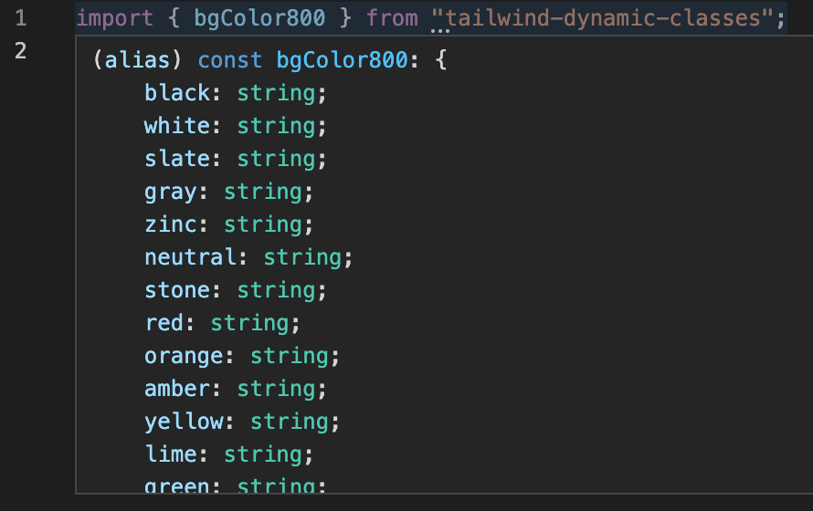

# Tailwind Dynamic Classes 

[](https://circleci.com/gh/matt-d-webb/tailwind-dynamic-classes/tree/master)
[](https://github.com/matt-d-webb/tailwind-dynamic-classes/actions/workflows/npm-publish.yml)


A utility library for dynamically using tailwind css color classes.

<div align="center" style="font-size:150px;">
🌈
</div>

Have you tried this? 

`text-${color}-500   ` ❌

Well, now you can try this ...

`${textColor500[color]}  ` ✅

### How to install

```bash
npm i --save tailwind-dynamic-classes
```

OR

```bash
yarn add tailwind-dynamic-classes
```


### Example usage:


```js
import { bgColor500, ...manyMore } from "tailwind-dynamic-classes"; 
```

React component example:

```jsx
const classNames = (...classes) => {
  return classes.filter(Boolean).join(" ");
};

const colors = [
    "red", "orange", "yellow",
    "green", "blue", "purple"
];

const Flag = ({ colors }) => {
    return (
        <> 
         {colors.map(color => {
             <Stripe {...{ color }}>
         })}
        </>
    )
}

const Stripe = ({ color }) => {
    return (
        <div className={classNames(bgColor500[color], "w-full h-40")}></div>
    )
};
```

You can also use these directly:

```jsx
import { textColor900, mdTextColor700 } from "tailwind-dynamic-classes";

// "text-color-red-900"
const red = textColor900.red;

// "md:text-color-blue-700"
const blue = mdTextColor700.blue; 
```

Includes `theme` and `screen` classes:

```jsx 
import { darkBgColor200, mdBorderColor50 } from "tailwind-dynamic-classes";
```

```js
// dark:bg-color-grey-200"
console.log(darkBgColor200.grey);

// md:bg-color-orange-200"
console.log(darkBgColor200.orange);
```

Quickly see which colors are generated:

<p align="center">
  
</p>

_Note: using a color here that isn't part of your config will **not** be picked up by 'tailwind' unless you're using the 'JIT' configuration option. Find out more here: [just-in-time engine](https://tailwindcss.com/docs/upgrade-guide#migrating-to-the-jit-engine)_

**Limitations** ✋ 

This does not support custom color pallette names defined in your `tailwind.config.js` file.

It takes the `@latest` color pallette generation from the `tailwindcss/colors` package.

